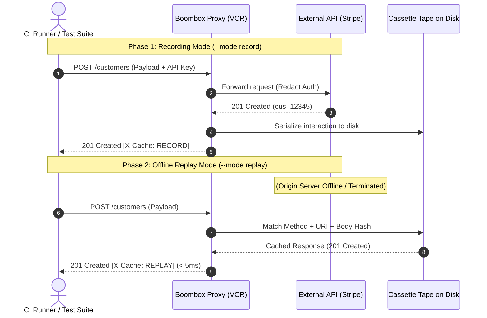

# Offline Integration Test Suite Demo

This directory demonstrates how to use **Boombox VCR Mode** to achieve **100% offline, deterministic, sub-15ms integration tests** without flakiness or rate limits.

---

## The Problem: The Third-Party API Trap
Enterprise apps frequently integrate with third-party payment, authentication, or communication APIs (e.g. Stripe, Twilio, GitHub, OpenAI). When test suites directly contact external servers:
1. **Flakiness**: Minor network latency or outages break CI builds.
2. **Rate Limits & Costs**: Testing against paid APIs burns token limits and sandbox rate caps.
3. **Offline Inability**: Tests cannot run on airplanes, offline trains, or restricted corporate networks.

---

## The Solution: Service Virtualization & Cassettes



---

## Running the Demo

Execute the end-to-end integration test with Bun:

```bash
bun test examples/offline-suite/checkout.test.js
```

### What This Test Verifies:
1. **Phase 1 [RECORD]**: Starts mock Stripe server, configures `--redact Authorization`, and records real interactions to a named cassette on disk.
2. **Phase 2 [OUTAGE]**: Completely shuts down and destroys the mock server instance.
3. **Phase 3 [REPLAY]**: Restarts proxy in `--mode replay` and runs the client suite.
   * All requests return `200 OK` or `201 Created` with `X-Cache: REPLAY` in `< 15ms`.
   * Unrecorded requests fail fast with `502 Bad Gateway`.
